# GoGovernment: Backend UML Class Diagram & 4-App Flow Architecture

## 1. Overview & Multi-App System Architecture

The **GoGovernment** ecosystem is built around a unified Node.js / Express / MongoDB / Socket.io backend that orchestrates data flow across **4 distinct applications**:

1. **Citizen Mobile App (Flutter)**: Citizen authentication, subsidized grocery/medicine discovery, order placement (Wallet/COD), civic complaints, transit navigation, and infrastructure feedback.
2. **Store Owner Mobile App (Flutter)**: Merchant onboarding & KYC, real-time audio-visual order alerts, 3-stage order pipeline (`accepted` → `preparing` → `ready_for_pickup`), product catalog management, and revenue payouts.
3. **Rider Delivery Mobile App (Flutter + Android Foreground Service)**: Background GPS tracking (every 10s), 30s dispatch countdown overlay, race-condition safe order claiming, pickup/drop navigation, and automated earnings.
4. **Admin Web Management Portal (Flutter Web)**: Merchant KYC review/approval, civic grievance dispatch & monitoring, feedback audits, and live rider tracking.

---

## 2. Complete Backend UML Class Diagram

```mermaid
classDiagram
    direction TB

    %% ==========================================
    %% 1. CORE DOMAIN MODEL ENTITIES
    %% ==========================================
    class User {
        +String userId
        +String phone
        +String userName
        +String email
        +String role
        +String profileImage
        +Number walletBalance
        +Number coinsBalance
        +String otp
        +Date otpExpires
        +String fcmToken
        +Date createdAt
        +Date updatedAt
        +toJSON()
    }

    class Address {
        +String addressId
        +String userId
        +String type
        +String description
        +String phone
        +String name
        +String floor
        +String landmark
        +String imagePath
        +Boolean isDefault
        +Boolean isDeleted
        +Number latitude
        +Number longitude
        +toJSON()
    }

    class Store {
        +String storeId
        +String name
        +String ownerName
        +String phone
        +String email
        +String category
        +String licenseNumber
        +String address
        +String pincode
        +GeoLocation location
        +String storeImage
        +String licenseDoc
        +BankDetails bankDetails
        +String role
        +String status
        +String rejectionReason
        +StoreTimings timings
        +Boolean isOnline
        +Number rating
        +Number walletBalance
        +String fcmToken
        +String otp
        +Date otpExpires
        +toJSON()
    }

    class Product {
        +String productId
        +String storeId
        +String title
        +String category
        +String unit
        +Number price
        +Number originalPrice
        +String discountPercentage
        +Number stock
        +Boolean isAvailable
        +String image
        +String[] images
        +Boolean hasVariants
        +Variant[] variants
        +String description
        +String brand
        +Boolean isSubsidized
        +String subsidyLimit
        +preSave()
        +toJSON()
    }

    class Variant {
        +String variantId
        +String unit
        +Number price
        +Number originalPrice
        +String discountPercentage
        +Number stock
        +Boolean isAvailable
        +String image
    }

    class Cart {
        +String userId
        +CartItem[] items
        +Date createdAt
        +Date updatedAt
        +toJSON()
    }

    class CartItem {
        +String productId
        +String variantId
        +String unit
        +Number price
        +Number quantity
        +Object product
    }

    class Order {
        +String orderId
        +String userId
        +String storeId
        +OrderItem[] items
        +Number itemTotal
        +Number deliveryCharge
        +Number handlingCharge
        +Number couponDiscount
        +Number coinsDiscount
        +Number grandTotal
        +String paymentMethod
        +String paymentStatus
        +DeliveryAddress deliveryAddress
        +StoreSnapshot storeDetails
        +String status
        +DeliveryAgent deliveryAgent
        +String estimatedDeliveryTime
        +Date deliveredAt
        +Date createdAt
        +Date updatedAt
        +toJSON()
    }

    class OrderItem {
        +String productId
        +String variantId
        +String title
        +Number price
        +Number originalPrice
        +Number quantity
        +String image
        +String unit
    }

    class Rider {
        +String riderId
        +String name
        +String phone
        +String email
        +String profileImage
        +String role
        +String vehicleType
        +String vehicleNumber
        +String drivingLicenseNumber
        +String drivingLicenseDoc
        +Boolean isOnline
        +Boolean isBusy
        +GeoLocation currentLocation
        +Number walletBalance
        +String otp
        +Date otpExpires
        +String fcmToken
        +Date createdAt
        +Date updatedAt
        +toJSON()
    }

    class WalletTransaction {
        +String transactionId
        +String userId
        +Number amount
        +String type
        +String category
        +String paymentMethod
        +String orderId
        +String title
        +String subtitle
        +Number balanceAfter
        +String status
        +Object metadata
        +toJSON()
    }

    class Complaint {
        +String complaintId
        +String userId
        +String userName
        +String userAddress
        +String category
        +String description
        +String status
        +Number statusColor
        +String imagePath
        +String date
        +Number likesCount
        +String[] likedBy
        +Comment[] comments
        +Date createdAt
        +Date updatedAt
        +toJSON()
    }

    class Comment {
        +String userName
        +String comment
        +String date
        +String userId
        +Number timestamp
    }

    class Feedback {
        +String feedbackId
        +String userId
        +String userName
        +String phone
        +String type
        +Number rating
        +String comments
        +SurveyAnswer[] surveyAnswers
        +Date createdAt
        +Date updatedAt
        +toJSON()
    }

    class SurveyAnswer {
        +String question
        +String answer
    }

    %% ==========================================
    %% 2. BACKEND CONTROLLERS & SERVICE ENGINES
    %% ==========================================
    class UserController {
        +sendOtp(req, res)
        +verifyOtp(req, res)
        +getProfile(req, res)
        +updateProfile(req, res)
        +sendPhoneUpdateOtp(req, res)
        +verifyPhoneUpdateOtp(req, res)
        +updateFcmToken(req, res)
        +logout(req, res)
    }

    class StoreController {
        +sendOtp(req, res)
        +verifyOtp(req, res)
        +registerStore(req, res)
        +getMyStore(req, res)
        +getApprovedStores(req, res)
        +getPendingStores(req, res)
        +getAllStores(req, res)
        +getStoreById(req, res)
        +toggleOnline(req, res)
        +reviewStore(req, res)
        +updateProfile(req, res)
        +updateFcmToken(req, res)
    }

    class RiderController {
        +sendOtp(req, res)
        +verifyOtp(req, res)
        +getProfile(req, res)
        +updateProfile(req, res)
        +toggleOnline(req, res)
        +updateLocation(req, res)
        +updateFcmToken(req, res)
        +logout(req, res)
    }

    class OrderController {
        +createOrder(req, res)
        +getAllOrders(req, res)
        +getLiveRiderLocations(req, res)
        +getUserOrders(req, res)
        +getStoreOrders(req, res)
        +getAvailableDeliveries(req, res)
        +getRiderDeliveries(req, res)
        +getOrderDetails(req, res)
        +acceptOrder(req, res)
        +updateOrderStatus(req, res)
        +deleteOrder(req, res)
    }

    class ProductController {
        +createProduct(req, res)
        +getProductsByStore(req, res)
        +getProductById(req, res)
        +updateProduct(req, res)
        +deleteProduct(req, res)
    }

    class WalletController {
        +getWalletDetails(req, res)
        +topupWallet(req, res)
        +deductWallet(req, res)
        +refundWallet(req, res)
        +redeemCoins(req, res)
    }

    class ComplaintController {
        +getStats(req, res)
        +getAllComplaints(req, res)
        +getComplaintById(req, res)
        +getUserComplaints(req, res)
        +createComplaint(req, res)
        +toggleLike(req, res)
        +addComment(req, res)
        +updateStatus(req, res)
    }

    class FeedbackController {
        +submitFeedback(req, res)
        +getAllFeedback(req, res)
        +getStats(req, res)
    }

    class DispatchEngine {
        -Map riderRegistry
        -Map dispatchTimers
        +haversineKm(lat1, lng1, lat2, lng2)
        +findNearestRiders(storeLat, storeLng, radiusKm, limit)
        +dispatchOrder(io, orderPayload, storeLat, storeLng, round)
    }

    class FCMService {
        +sendToUser(fcmToken, title, body, data)
        +sendToStore(fcmToken, orderData)
        +sendToRiderOrderAlert(fcmToken, orderData)
        +sendOrderStatusNotification(order, oldStatus, newStatus)
    }

    %% ==========================================
    %% 3. RELATIONSHIPS & CARDINALITIES
    %% ==========================================

    %% User Relations
    User "1" --> "0..*" Address : owns
    User "1" --> "1" Cart : maintains
    User "1" --> "0..*" Order : places
    User "1" --> "0..*" WalletTransaction : logs
    User "1" --> "0..*" Complaint : files
    User "1" --> "0..*" Feedback : submits

    %% Store Relations
    Store "1" --> "0..*" Product : catalogs
    Store "1" --> "0..*" Order : fulfills

    %% Product & Variant Composition
    Product "1" *-- "0..*" Variant : contains

    %% Cart & Item Composition
    Cart "1" *-- "0..*" CartItem : contains
    CartItem --> Product : references

    %% Order Composition & Associations
    Order "1" *-- "1..*" OrderItem : contains
    Order --> User : placedBy
    Order --> Store : belongsTo
    Order --> Rider : assignedTo

    %% Grievance & Survey Composition
    Complaint "1" *-- "0..*" Comment : includes
    Feedback "1" *-- "1..*" SurveyAnswer : answers

    %% Controller & Service Dependencies
    OrderController ..> Order : manages
    OrderController ..> User : debits/refunds
    OrderController ..> Product : checks/restores stock
    OrderController ..> DispatchEngine : triggers dispatch
    OrderController ..> FCMService : triggers notifications

    StoreController ..> Store : registers/updates
    RiderController ..> Rider : tracks/updates
    UserController ..> User : authenticates
    ProductController ..> Product : CRUD operations
    WalletController ..> WalletTransaction : creates ledger entries
    ComplaintController ..> Complaint : updates resolution
    FeedbackController ..> Feedback : aggregates civic scores
    DispatchEngine ..> FCMService : wakes sleeping rider
```



---

## 3. Detailed Class Attribute & Method Specifications

### 3.1 Domain Model Classes (Mongoose Schemas)

#### 1. `User` (Citizen Entity)
* **Purpose**: Represents citizen profile, digital wallet balance, civic coin balance, and OTP credentials.
* **Attributes**:
  * `userId`: String (Unique index, e.g. `USR_001`)
  * `phone`: String (Unique index)
  * `userName`: String
  * `email`: String
  * `role`: String (`citizen`, `rider`, `admin`)
  * `profileImage`: String
  * `walletBalance`: Number (Currency balance in ₹)
  * `coinsBalance`: Number (Civic reward coins earned from feedback/grievances)
  * `otp` / `otpExpires`: String / Date (Temporary verification token)
  * `fcmToken`: String (Push notification registration token)
* **Methods**:
  * `toJSON()`: Serializer removing internal `_id`, `otp`, and sensitive tokens.

#### 2. `Store` (Merchant Entity)
* **Purpose**: Represents government-verified fair-price shops, medical dispensaries, and grocery depots.
* **Attributes**:
  * `storeId`: String (Unique index, e.g. `STR_101`)
  * `name`, `ownerName`, `phone`, `email`: String
  * `category`: Enum (`ration`, `medical`, `vegstore`, `supermarket`, `general`, `dairy`)
  * `licenseNumber`, `licenseDoc`, `storeImage`: String (KYC documentation)
  * `address`, `pincode`: String
  * `location`: `{ lat: Number, lng: Number }`
  * `bankDetails`: `{ bankName, accountNumber, ifscCode, accountHolderName }`
  * `status`: Enum (`pending`, `approved`, `rejected`)
  * `isOnline`: Boolean
  * `timings`: `{ open: String, close: String }`
  * `rating`: Number (Default: 4.5)
  * `walletBalance`: Number (Accumulated merchant earnings)

#### 3. `Product` & `Variant` (Catalog & Inventory)
* **Purpose**: Items listed by stores with support for fair-price subsidies and multiple pack sizes.
* **Attributes (Product)**:
  * `productId`: String (Unique index)
  * `storeId`: String (Indexed foreign key to `Store`)
  * `title`, `category`, `unit`: String
  * `price`, `originalPrice`: Number
  * `stock`: Number
  * `isAvailable`: Boolean
  * `hasVariants`: Boolean
  * `variants`: Array of `Variant`
  * `isSubsidized`: Boolean (Govt fair-price ration flag)
  * `subsidyLimit`: String
* **Attributes (Variant)**:
  * `variantId`: String
  * `unit`: String (e.g. `500 g`, `1 kg`, `5 kg`)
  * `price`, `originalPrice`, `stock`: Number
  * `isAvailable`: Boolean

#### 4. `Order` & `OrderItem` (Commerce & Logistics Backbone)
* **Purpose**: Encapsulates 5-stage order lifecycle, payments, item snapshots, and delivery routing.
* **Attributes (Order)**:
  * `orderId`: String (Unique index, e.g. `ORD_10024`)
  * `userId`: String (Citizen reference)
  * `storeId`: String (Merchant reference)
  * `items`: Array of `OrderItem`
  * `itemTotal`, `deliveryCharge`, `handlingCharge`: Number
  * `couponDiscount`, `coinsDiscount`: Number
  * `grandTotal`: Number
  * `paymentMethod`: String (`Wallet`, `Cash on Delivery`)
  * `paymentStatus`: Enum (`pending`, `paid`, `failed`)
  * `deliveryAddress`: `{ address, latitude, longitude, receiverName, receiverPhone }`
  * `storeDetails`: `{ storeId, name, address, latitude, longitude, phone }`
  * `status`: Enum (`placed`, `preparing`, `ready_for_pickup`, `accepted`, `out_for_delivery`, `delivered`, `cancelled`)
  * `deliveryAgent`: `{ riderId, name, phone, vehicleNumber, rating }`
  * `deliveredAt`: Date
* **Attributes (OrderItem)**:
  * `productId`, `variantId`, `title`, `unit`, `image`: String
  * `price`, `originalPrice`, `quantity`: Number

#### 5. `Rider` (Delivery Personnel)
* **Purpose**: Delivery agent profile, vehicle details, live GPS coordinates, and duty status.
* **Attributes**:
  * `riderId`: String (Unique index, e.g. `RDR_007`)
  * `name`, `phone`, `email`, `profileImage`: String
  * `vehicleType`: Enum (`bike`, `scooter`, `ev`, `cycle`, `other`)
  * `vehicleNumber`, `drivingLicenseNumber`, `drivingLicenseDoc`: String
  * `isOnline`: Boolean (On-duty toggle)
  * `isBusy`: Boolean (Locked during active order delivery)
  * `currentLocation`: `{ lat: Number, lng: Number }`
  * `walletBalance`: Number (Rider earnings: base ₹40 + surges)
  * `fcmToken`: String

#### 6. `WalletTransaction` (Double-Entry Financial Ledger)
* **Purpose**: Audit-proof record of every financial credit and debit.
* **Attributes**:
  * `transactionId`: String (Unique index, e.g. `TXN_98721`)
  * `userId`: String (Foreign key to User / Merchant / Rider)
  * `amount`: Number (Positive for credit, negative for debit)
  * `type`: Enum (`credit`, `debit`)
  * `category`: Enum (`topup`, `order_payment`, `order_refund`, `reward_redemption`, `cashback`, `rider_payout`, `store_settlement`)
  * `orderId`: String
  * `balanceAfter`: Number
  * `status`: Enum (`success`, `failed`, `pending`)

#### 7. `Complaint` & `Comment` (Civic Grievance Reporting)
* **Purpose**: Geotagged public civic complaints (potholes, garbage, broken streetlights).
* **Attributes**:
  * `complaintId`: String
  * `userId`, `userName`, `userAddress`: String
  * `category`: String (`Roads`, `Sanitation`, `Streetlights`, `Water`)
  * `description`, `imagePath`: String
  * `status`: Enum (`Under Review`, `In Progress`, `Resolved`)
  * `likesCount`, `likedBy`: Number / Array
  * `comments`: Array of `Comment` `{ userName, comment, date, userId, timestamp }`

#### 8. `Feedback` & `SurveyAnswer` (Civic Infrastructure Audit)
* **Purpose**: 4-Pillar ward-level survey on civic amenities with reward coin incentives.
* **Attributes**:
  * `feedbackId`, `userId`, `userName`, `phone`: String
  * `type`: Enum (`survey`, `app_rating`, `general`)
  * `rating`: Number (1 to 5)
  * `comments`: String
  * `surveyAnswers`: Array of `SurveyAnswer` `{ question, answer }`

---

## 4. Class Relationships & Cardinality Matrix

| Source Class | Target Class | Relationship Type | Cardinality | Description |
| :--- | :--- | :--- | :--- | :--- |
| `User` | `Address` | Aggregation | `1` to `0..*` | Citizen saves multiple delivery addresses. |
| `User` | `Cart` | Association | `1` to `1` | One isolated persistent active cart per citizen. |
| `User` | `Order` | Association | `1` to `0..*` | Citizen places multiple historical orders. |
| `User` | `WalletTransaction` | Association | `1` to `0..*` | Ledger of user top-ups, debits, and refunds. |
| `User` | `Complaint` | Association | `1` to `0..*` | Citizen submits civic grievances. |
| `User` | `Feedback` | Association | `1` to `0..*` | Citizen participates in 4-pillar municipal surveys. |
| `Store` | `Product` | Aggregation | `1` to `0..*` | Store maintains a catalog of products. |
| `Store` | `Order` | Association | `1` to `0..*` | Store receives and fulfills incoming orders. |
| `Product` | `Variant` | Composition | `1` to `0..*` | Product contains variant sizes/weights. |
| `Cart` | `CartItem` | Composition | `1` to `0..*` | Cart contains individual item lines. |
| `Order` | `OrderItem` | Composition | `1` to `1..*` | Order freezes immutable line items upon checkout. |
| `Order` | `Rider` | Association | `0..*` to `0..1` | A delivery rider claims and fulfills an order. |
| `Complaint` | `Comment` | Composition | `1` to `0..*` | Complaint discussion comments thread. |
| `Feedback` | `SurveyAnswer`| Composition | `1` to `1..*` | Survey contains specific question-answer pairs. |
| `OrderController`| `DispatchEngine` | Dependency | `1` to `1` | Order triggers proximity escalation dispatch. |
| `OrderController`| `FCMService` | Dependency | `1` to `1` | Order status changes emit push notifications. |

---

## 5. 4-App Flow to Backend Classes Mapping

```
                                  ┌───────────────────────────┐
                                  │   CENTRAL NODE.JS BACKEND │
                                  │   & MONGOOSE DATABASE     │
                                  └─────────────┬─────────────┘
                                                │
         ┌───────────────────────┬──────────────┴──────────────┬───────────────────────┐
         │                       │                             │                       │
         ▼                       ▼                             ▼                       ▼
┌──────────────────┐   ┌──────────────────┐         ┌──────────────────┐   ┌──────────────────┐
│ 1. CITIZEN APP   │   │  2. STORE APP    │         │  3. RIDER APP    │   │  4. ADMIN WEB    │
│    (Citizen)     │   │   (Merchant)     │         │   (Logistics)    │   │   (Governance)   │
└──────────────────┘   └──────────────────┘         └──────────────────┘   └──────────────────┘
```

### Flow 1: Citizen Mobile Application
* **Models Accessed**: `User`, `Address`, `Product`, `Cart`, `Order`, `WalletTransaction`, `Complaint`, `Feedback`.
* **Controllers Invoked**:
  * `userController`: OTP login, profile updates, FCM token sync.
  * `storeController`: `getApprovedStores` (GPS-based discovery of active fair-price stores).
  * `productController`: `getProductsByStore` (catalog browsing, subsidies inspection).
  * `cartController`: `addToCart`, `updateQuantity`, `syncCart` (isolated to a single store).
  * `orderController`: `createOrder` (Wallet balance debit or COD), `getUserOrders`, `deleteOrder` (instant wallet refund + stock auto-restoration).
  * `walletController`: `getWalletDetails`, `topupWallet`, `redeemCoins` (100 coins = ₹1 cash).
  * `complaintController`: `createComplaint` (geotagged photo), `toggleLike`, `addComment`.
  * `feedbackController`: `submitFeedback` (4-pillar audit, awards +50 civic coins).
* **Real-Time Sockets**:
  * Listens to `order:<orderId>:status` (stepper: `preparing` → `ready_for_pickup` → `out_for_delivery` → `delivered`).
  * Listens to `order:<orderId>:rider_location` (live map polyline of approaching rider).

### Flow 2: Store Owner Mobile Application
* **Models Accessed**: `Store`, `Product`, `Order`, `WalletTransaction`.
* **Controllers Invoked**:
  * `storeController`: `registerStore` (KYC trade license, storefront photo), `getMyStore`, `toggleOnline`.
  * `productController`: `createProduct`, `updateProduct`, `deleteProduct` (price, stock, unit, variants).
  * `orderController`: `getStoreOrders`, `updateOrderStatus` (`preparing` → `ready_for_pickup`).
* **Real-Time Sockets**:
  * Joins room `store:<storeId>`.
  * Listens to `order:new` (triggers full-screen modal alert and chime audio).
  * Listens to `order:cancelled` (triggers visual alert and automatically restores product stock).

### Flow 3: Rider Delivery Mobile Application
* **Models Accessed**: `Rider`, `Order`, `WalletTransaction`.
* **Controllers Invoked**:
  * `riderController`: `toggleOnline` (duty status), `updateLocation` (GPS coordinates), `getProfile`.
  * `orderController`: `getAvailableDeliveries`, `acceptOrder` (atomic exclusive lock), `getRiderDeliveries`, `updateOrderStatus` (`out_for_delivery` → `delivered`).
* **Real-Time Sockets & Background Service**:
  * Joins room `riders` and `rider:<riderId>`.
  * Background isolate emits `rider:location_ping` every 10-20 seconds.
  * Listens to `order:dispatch` (displays 30-second countdown dispatch overlay with guaranteed ₹40+ earnings).
  * Listens to `order:dispatch_cancelled` (dismisses notification if another rider accepts first).
  * Emits `rider:location` to stream real-time GPS coordinates directly to the citizen's order screen.

### Flow 4: Admin Web Management Portal
* **Models Accessed**: `Store`, `Complaint`, `Feedback`, `Order`, `Rider`.
* **Controllers Invoked**:
  * `storeController`: `getPendingStores`, `reviewStore` (1-click KYC approve/reject).
  * `complaintController`: `getStats`, `getAllComplaints`, `updateStatus` (`Under Review` → `In Progress` → `Resolved`).
  * `feedbackController`: `getStats`, `getAllFeedback` (analyzes ward-level civic cleanliness and infrastructure scores).
  * `orderController`: `getAllOrders`, `getLiveRiderLocations` (displays real-time delivery map).
* **Real-Time Sockets**:
  * Listens to `new_feedback` (real-time municipal survey submission alerts).
  * Listens to `complaint:status_change` and live order tracking streams.

---

## 6. How to Draw This Diagram (Step-by-Step Guide)

If you are drawing this diagram for **College Project Viva, Documentation, or a Presentation** (in **Draw.io**, **StarUML**, **Lucidchart**, or **Pen & Paper**):

### Step 1: Draw the 3 Tiers
Organize your canvas into 3 clean visual zones:
1. **Top Zone (4 Client Apps)**: 4 boundary boxes (`Citizen Mobile App`, `Store Owner App`, `Rider App`, `Admin Web Portal`).
2. **Middle Zone (Controllers & Business Logic Engines)**:
   - `UserController`, `StoreController`, `RiderController`, `OrderController`, `ProductController`, `WalletController`, `ComplaintController`, `FeedbackController`
   - Real-time engine helpers: `DispatchEngine` and `FCMService`.
3. **Bottom Zone (Persistent Domain Models / Database Entities)**:
   - `User`, `Store`, `Rider`, `Order`, `Product`, `Cart`, `Address`, `WalletTransaction`, `Complaint`, `Feedback`.

### Step 2: Draw the Class Boxes (3-Compartment Standard UML)
For each class, draw a rectangle divided into 3 compartments:
* **Top compartment**: Class Name (e.g. `Order`, `User`, `Store`).
* **Middle compartment**: Attributes with visibility (`+` for public, `-` for private) and Type (e.g., `+orderId: String`, `+grandTotal: Number`).
* **Bottom compartment**: Operations/Methods (e.g., `+createOrder()`, `+updateOrderStatus()`).

### Step 3: Connect with Correct UML Arrow Notations
* **Composition (`*───`) Solid diamond at whole**:
  - `Product` *── `Variant`
  - `Order` *── `OrderItem`
  - `Cart` *── `CartItem`
  - `Complaint` *── `Comment`
  - `Feedback` *── `SurveyAnswer`
* **Aggregation (`o───`) Hollow diamond at whole**:
  - `User` o── `Address`
  - `Store` o── `Product`
* **Direct Association (`───>` Solid line with open arrowhead)**:
  - `User` ───> `Order` (`1` to `0..*`)
  - `Store` ───> `Order` (`1` to `0..*`)
  - `Rider` ───> `Order` (`0..1` to `0..*`)
  - `User` ───> `WalletTransaction` (`1` to `0..*`)
* **Dependency (`- - - >` Dashed line with open arrowhead)**:
  - Controllers pointing to Models (`OrderController` - - - > `Order`, `WalletController` - - - > `WalletTransaction`).
  - `OrderController` - - - > `DispatchEngine` and `FCMService`.
